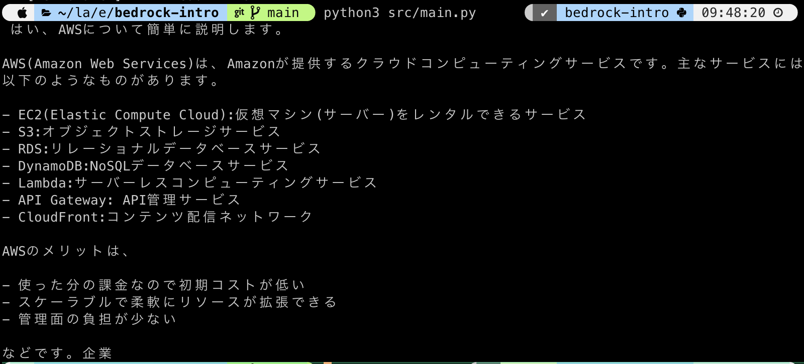

# bedrock-intro

## requirements
1. Python3 (higher 3.11.6)

## setup
1. git clone
1. cd bedrock-intro
1. pip3 install -r requirements.txt ← install libraries.
1. cp src/.env.example src/.env
1. setting .env file.
1. python3 src/main.py

## Tips
* [venv](https://camp.trainocate.co.jp/magazine/venv-python/)

## Reference
* https://qiita.com/hedgehog051/items/f9dcf353ec06c23b40e5

## demo

